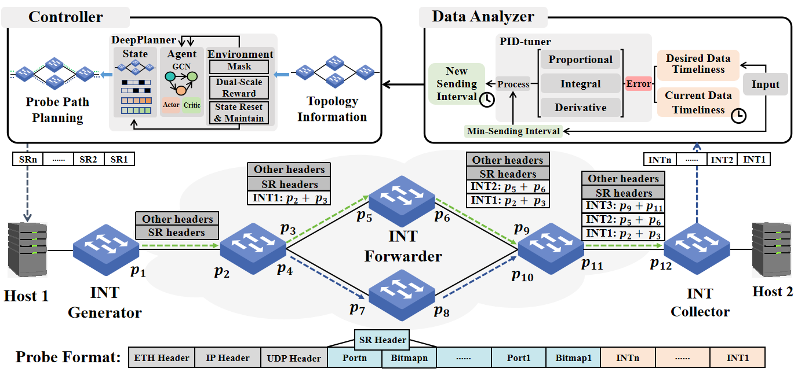
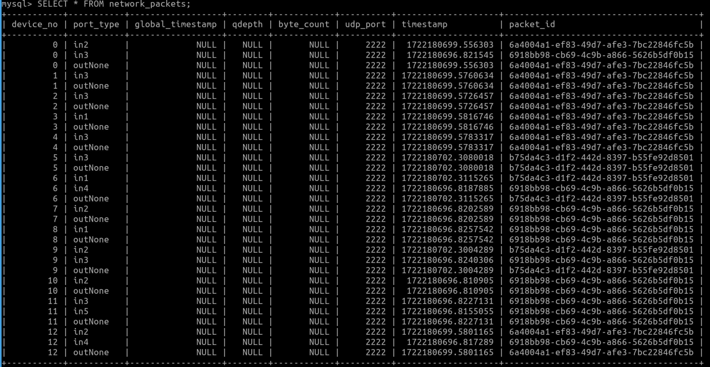
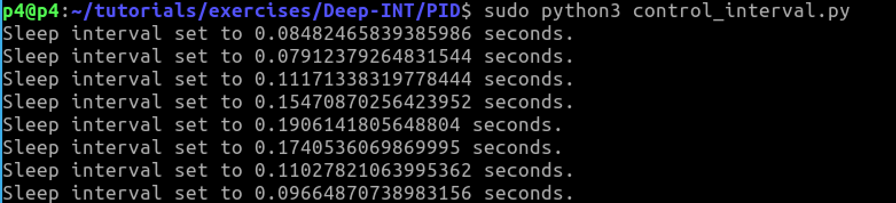

# Deep-INT: Towards Generic and Tunable In-band Network Telemetry Orchestration
In-band network telemetry (INT) is an emerging technique that enables real-time, fine-grained network monitoring. To achieve efficient network-wide telemetry, it is necessary to orchestrate the INT primitive. However, the widespread implementation of INT across various network scenarios, coupled with the diverse telemetry requirements of network administrators, has presented heterogeneous network topologies and mutually constrained telemetry optimization objectives as significant challenges in real deployment. In this paper, we propose Deep-INT, a generic and tunable INT orchestration system comprised of two primary components: DeepPlanner and PID-tuner. DeepPlanner is a deep reinforcement learning framework that employs a graph convolutional network for state encoding and utilizes a dualscale reward along with an action mask to ensure the valid and non-redundant probe path planning. Additionally, we develop PID-tuner, a proportional-integral-derivative (PID) based control approach to automatically adjust the probe sending intervals.
## Overview of Deep-INT

## Requirements
- The development and testing environment for this project is based on [P4 tutorials](https://github.com/p4lang/tutorials/tree/master), which provides a series of P4 program examples and tools for learning and experimenting with the P4 language. Specifically, the project uses the following environment and tools:
  1. [P4 Compiler (p4c)](https://github.com/p4lang/p4c): Used to compile P4 programs into a format that the target device can understand.
  2. [Behavioral Model (BMv2)](https://github.com/p4lang/behavioral-model/blob/main/docs/simple_switch.md): A software P4 switch used for simulating and testing P4 programs. 
  3. [Mininet](https://github.com/mininet/mininet) supporting bmv2: Used to create and manage virtual network topologies for testing P4 programs in a simulated environment.
  4. [P4Runtime](https://p4.org/specs/): Used for runtime control of the behavior of P4 switches.
- Operating System: Linux Ubuntu 20.04
- Python Version: >= 3.8
## Code Architecture
```
-- PID
	-- control_interval.py
	-- no-control_interval.py

-- DeepPlanner
	-- env/
        -- temetry_a2c/
        -- temetry_pg/
        -- temetry_ppo/
        -- topo/
        -- telemetry_main_a2c.py
	-- telemetry_main_pg.py
	-- telemetry_main_ppo.py
-- other_algo
        -- dfs.py
        -- euler_balance.py
        -- euler_unbalance.py
        -- INT_balance.py
-- Syetem
	-- utils
                -- mininet/
                -- p4runtime_lib/
		-- run_exercise.py
		-- netstat.py
		-- p4_mininet.py
        	-- p4runtime_switch.py
                -- script_basic.sh
                -- Makefile
	-- INT
	        -- topos/
	        -- switch-config/
                -- app.p4
                -- header.p4
                -- parser.p4
                -- receivenew.py
                -- sendint.py
                -- Makefile

```
## other_algo
Comparison algorithms
## DeepPlanner
**env/**：The environment of DRL algorithm

**temetry_a2c/**：The policy of A2C algorithm

**temetry_pg/**：The policy of PG algorithm

**temetry_ppo/**：The policy of PPO algorithm

**topo/**：The topologies used in this project

## System

**utils/run_int.py**：To create a experimental Mininet environment and create specified probes

**utils/script_basic.sh**:To configure flow table information of OVS switch

**utils/Makefile**：Compile P4 programs and run the BMv2 simulator

**INT/topos/**：All topologies used in the project

**INT/switch-config/**：To configure flow tables of different switches

**INT/INT.p4**：Do source routing and INT

**INT/header.p4**：Define Headers and Metadatas

**INT/parser.p4**：Define parser, deparser and checksum calculator

**INT/receiveint.py**：Collect INT probe packets and storing the collected network information in the database

**INT/sendint.py**：Send INT probe packets

**INT/Makefile**：Set the BMv2 switch executable to simple_switch_grpc and specifies the default topology file as topos/Nsfnet.json

## Start DeepPlanner
### Activate Coding Environment
To create a new conda environment, execute the following command:
```
conda create --name deepint python==3.8
```
Activate the created environment with:
```
conda activate deepint
```
### Install Required Packages
The following package can be installed using pip:
```
sudo pip install tianshou==0.4.11
sudo pip install matplotlib==3.7.3
sudo pip install scipy==1.10.1
sudo pip install torch_geometric==2.5.3
```
### Start Training
```
cd DeepPlanner
sudo python3 telemetry_main_a2c.py
sudo python3 telemetry_main_pg.py
sudo python3 telemetry_main_ppo.py
```
## Start INT
Start the system:
```
cd System/INT
sudo make run
```
Input INT paths:
For example(Nsfnet):
```
input: [[[17, 20, 22, 2, 16, 13, 29, 24, 21]], [[7, 27, 8, 3, 5, 0]], [[12, 10, 18]]]
```
The INT information can be found in your database like this:


## PID Control
You need to revise the sendint.py script to continuously send INT probes.
Start INT system.
Then run PID control script:
```
sudo python3 control_interval.py
```
Then the new sending interval will be set：

